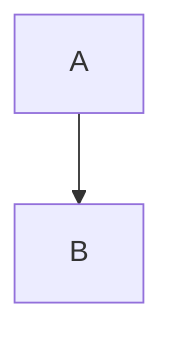
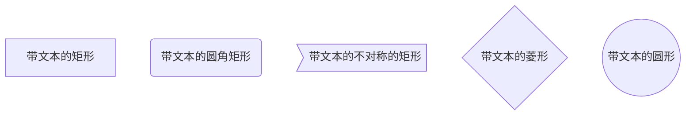

# hello-world
nothing</br>
Nice to see you here,don't you think so?</br>
This time,I wanna learn sth about `markdown` ``markdown`` ```markdown```.</br></br>

# 这是一级标题
## 这是二级标题
### 这是三级标题
#### 这是四级标题
##### 这是五级标题
###### 这是六级标题</br></br>

**这是加粗的文字**</br>
*这是倾斜的文字*`</br>
***这是斜体加粗的文字***</br>
~~这是加删除线的文字~~</br></br>

>这是引用的内容
>>这是引用的内容
>>>>>>>>>>这是引用的内容

---
----
***
*****


["My GitHub"](https://github.com/qiaork "qiaork")
- 列表内容
+ 列表内容
* 列表内容
   - 111
   + 222
   * 333
      - 11111
      2. 22222
      * 33333
         - 1111111
         + 2222222
         * 3333333
            - 1111
               - 11111
                  - 111111
1. 列表内容
2. 列表内容
3. 列表内容
   1. 111
   2. 222
   3. 333
      1. 111
      2. 222
      - 333
         1. 11111
         2. 22222
            1. 1111111
               1. 111111111

姓名|技能|排行
--|:--:|--:
刘备|哭|大哥
关羽|打|二哥
张飞|骂|三弟

`print('Hello World')`

```
def hello:
  print('hello'）
```

```flow
st=>start: 开始
op=>operation: My Operation
cond=>condition: Yes or No?
e=>end
st->op->cond
cond(yes)->e
cond(no)->op
```




